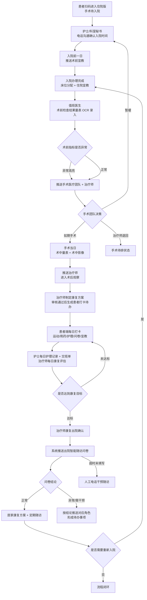

# 骨安 · 用户端业务 SOP 流程

> 适用范围：骨安小程序「患者/家属端」为主线，护士（科室秘书）、值班医生、手术医疗团队、康复治疗师端作为协同节点。
> 颗粒度：操作级 + 异常处理。
> 版本：v1.0 ｜ 更新日期：2026-08-24

---

## 一、总览

### 1.1 角色与端

| 角色 | 端内定位 | 核心职责 |
| --- | --- | --- |
| 患者 / 家属 | 患者端（院内版 / 居家版） | 建档、量表填写、每日打卡、宣教学习、随访问卷 |
| 护士（科室秘书） | 护士工作台 | 待入院沟通、入院时间确认、床位分配、宣教推送、每日护理记录与交班 |
| 值班医生 | 值班医生工作台 | 住院录入、术前检查结果量表 OCR 录入、推送手术团队 |
| 手术医疗团队 | 手术团队工作台 | 术前量表评估决策（如期/暂缓/退回）、术中量表与影像记录、推送治疗师 |
| 康复治疗师 | 治疗师工作台 | 康复方案制定与审核、每日康复评估、出院评估确认、退回待排 |

### 1.2 患者端信息架构

```
底部导航
├── 首页    状态卡（姓名/住院天数/床位/今日待办徽章）· 当前阶段（点击展开路径轨道）
│           · 分类待办 · 专属服务群横幅 · 服务包横幅 · 快捷入口悬浮拉手
├── 日程    近 7 天打卡明细（全天任务置顶 → 按时段）· 完成统计
├── 骨灵    AI 康复问答（一屏展全，支持语音输入）
├── 科普    按病症 + 当前阶段精准推送的宣教内容（支持关键字搜索/主题筛选）
└── 我的    基本情况、健康档案（体征 / 医疗团队）、服务与设置
```

快捷入口（悬浮拉手，长按可拖动改变位置）固定顺序：
**完善档案 → 风险评估 → 健康方案 → 问卷评估 → 今日任务 → 用药管理 → 数据录入 → 饮食打卡**

### 1.3 患者视角住院 6 阶段

| 序号 | 阶段 | 患者要做的事 |
| --- | --- | --- |
| 01 | 入院准备 | 证件与用品准备、术前检查预约、入院须知宣教 |
| 02 | 住院当日 | 入院登记、床位确认、护理评估、住院宣教 |
| 03 | 术前一日 | 禁食水、皮肤准备、麻醉与术中配合宣教 |
| 04 | 术后康复 | 体位摆放、疼痛管理、踝泵/屈膝训练打卡 |
| 05 | 出院引导 | 出院评估、用药与复查安排、居家方案获取 |
| 06 | 随访关怀 | 智能随访问卷、居家康复打卡、异常上报 |

---

## 二、主流程图



---

## 三、患者端操作级 SOP

### SOP-1 新用户建档（未建档视角）

首页顶部展示「您好，三步开启健康之旅」及三步卡片。

| 步骤 | 操作 | 系统动作 | 完成判定 |
| --- | --- | --- | --- |
| 1 | 首页 → 第 1 步「拍照上传」→ 拍摄/相册选择入院单 | OCR 识别姓名、住院号、诊断、手术名称、术者、拟手术日期 | 档案生成，视角切换为已建档 |
| 2 | 第 2 步「填写量表」→ 专病量表 + 生活问卷 | 提交后同步治疗师与值班医生 | 量表状态为已完成 |
| 3 | 第 3 步「查看待办」 | 跳转今日任务，若方案未审核提示"等待治疗师审核" | 出现任务清单 |

**异常处理**
- OCR 识别失败或字段缺失 → 提示"识别不清"，允许手动补填必填字段（姓名、住院号、手术名称）后提交。
- 未建档用户访问健康方案/今日任务 → 功能锁定，引导回第 1 步。
- 重复上传入院单 → 覆盖旧识别结果前二次确认。

### SOP-2 加入专属服务群

首页「专属服务群」横幅（琥珀色高对比）→ 点击「立即加入」→ 弹出企微群二维码页 → 「保存二维码」提示保存成功 → 微信扫码入群。
群内为 AI 康复问答与助手服务，不承诺真人医生答疑。

### SOP-3 每日任务打卡

1. 首页「今日待办」徽章 → 点击滚动至任务区（或快捷入口 → 今日任务）。
2. 任务排序规则：**全天任务置顶**，其余按分类（康复动作 → 用药 → 护理 → 问卷 → 宣教）与时段排列。
3. 逐项点击勾选完成；运动类可查看动作要点/视频；宣教类进入播放页，播放完毕自动标记已读。
4. 日程页可查看近 7 天打卡明细与完成率。

**异常处理**
- 疼痛评分 ≥ 6 分 → 自动生成异常指标并推送治疗师，方案建议减量。
- 任务连续 2 日未打卡 → 生成提醒消息，护士/治疗师端出现跟进待办。
- 漏服抗凝药 → 用药管理内标记漏服，提示咨询医护，不自行补服双倍剂量。

### SOP-4 数据录入与饮食打卡

- 数据录入：血压、体温、心率、体重、伤口情况；超出阈值即高亮为异常，多端同步。
- 饮食打卡：拍照识别菜品 → 归入营养方案/药食同源 → 支持替换菜品。

### SOP-5 健康方案查看

- 院内版：康复方案（分阶段动作与角度目标）+ 注意事项 + 护理要点。
- 居家版：居家康复方案 + 运动方案 + 营养方案 + 药食同源（菜品可更换）。
- 所有方案条目最终折叠为患者的打卡待办。默认用户为已付费状态，无付费墙。

### SOP-6 骨灵 AI 问答

进入「骨灵」页 → 文字或语音提问 → 返回结合当前阶段与病症的康复建议。红旗症状（发热、伤口红肿热痛、突发肿胀疼痛）一律给出"立即就诊"提示，不做诊断结论。

### SOP-7 随访关怀（院外）

1. 出院确认后系统推送智能随访问卷。
2. 患者按提醒填写 → 结论分级。
3. 结论异常 → 推送对应角色形成待办；超时未填写 → 转人工电话随访。
4. 需要重新入院 → 沿用原床位重新进入院内康复，治疗师/护士继续每日录入。

---

## 四、协同角色关键节点（辅线）

### 4.1 护士（科室秘书）
1. 打开待入院清单 → 逐个拨打电话 → 记录并**编辑入院时间**。
2. 入院前一日推送宣教内容至患者端（生成患者端消息提醒）。
3. 入院当日：床位分配（支持拍照留存）→ 住院宣教 → 护理评估。
4. 每日护理记录：备注 + 指标录入，异常项自动高亮并多端同步。
5. 生成当日交班单（含床位、术后天数、护理备注、异常指标、方案完成度）。
6. 患者查询：支持姓名/电话检索。

**异常处理**：电话未接 → 标记待再拨；沟通困难/传染病/急诊 → 打标签，床位分配优先处理。

### 4.2 值班医生
1. 手术前一日接收待录入清单（每天录入待手术患者的检查结果）。
2. 术前检查结果量表 OCR 录入 → 校对字段 → 标记异常项。
3. 推送手术医疗团队 + 治疗师。

**分流规则**：入院时间与手术时间为同一天的患者，**不进入值班医生环节**，系统直接推送手术医疗团队（值班医生端在「入院当日手术 · 直推手术团队」中只读可见）。

**异常处理**：当天未采集到数据 → 患者信息保留至次日继续补充，不清空，出现在「待补充术前评估」清单中。

### 4.3 手术医疗团队
1. 接收术前量表（异常高亮）→ 决策：如期手术 / 暂缓 / 退回待排（需填原因）。
2. 手术当日填写术中量表（团队任一成员可填写与修改）：麻醉方式、术中出血、手术时长、术中并发症、假体型号、医生建议。
3. 上传术中影像（支持相册），保留近 3 天。
4. 历史术中量表按时间倒序保留近 3 天。
5. 推送治疗师，进入术后观察。

**异常判定规则**：出血 ≥ 400ml、手术时长 ≥ 120 分钟、存在术中并发症 → 判为异常，多端高亮。

### 4.4 康复治疗师
1. 接收术中量表与医生建议 → 制定康复方案（目标、注意事项、动作、管理要点，动作/角度支持自定义编辑与语音输入）。
2. 方案审核通过 → 自动生成患者端打卡待办。
3. 每日康复评估：疼痛评分、伸直/屈膝角度、训练内容。
4. 在院/出院筛选 + 待审核方案列表；已评估患者保留 3 日。
5. 出院由治疗师决定：达标 → 康复出院确认（出院评估字段增强），患者转入历史出院列表；**康复未达预期 → 选择「继续住院」**，患者保持在院状态，护士与治疗师继续每日记录。
6. 出院后 **3 天内**支持将患者重新变更为入院状态（沿用原床位），护士端与治疗师端同步展示；超过 3 天需按门诊待入院流程重新办理。
6. 术前/术中指标异常时可将患者退回手术待排状态。

---

## 五、角色职责与权限矩阵（RACI）

R=执行 A=负责 C=咨询 I=知会

| 环节 | 患者 | 护士 | 值班医生 | 手术团队 | 治疗师 |
| --- | --- | --- | --- | --- | --- |
| 扫码进入待入院 | R | A | I | I | I |
| 入院时间确认 | C | R/A | I | — | — |
| 床位分配 | I | R/A | I | — | — |
| 入院/术前宣教推送 | R（学习） | R/A | I | — | C |
| 术前检查量表录入 | C | I | R/A | I | I |
| 手术决策 | I | I | C | R/A | C |
| 术中量表与影像 | — | I | I | R/A | I |
| 康复方案制定与审核 | I | I | I | C | R/A |
| 每日打卡执行 | R | C | — | — | A |
| 每日护理记录/交班 | I | R/A | I | I | I |
| 每日康复评估 | C | I | I | I | R/A |
| 康复出院确认 | I | C | C | C | R/A |
| 随访问卷 | R | C | I | I | A |
| 人工电话随访干预 | C | R/A | I | — | C |
| 重新入院 | R | R | I | C | A |

**权限约束**
- 患者端：只读方案与宣教，可写打卡/量表/数据录入/饮食记录，不可修改医疗结论。
- 护士：入院时间、床位、护理记录、交班、宣教推送。
- 值班医生：术前量表录入与推送。
- 手术团队：术中量表全员可编辑，仅内容调整，不可删除历史记录。
- 治疗师：方案、康复评估、出院确认、退回待排。

---

## 六、数据字段与量表清单

### 6.1 患者主档
`姓名 / 年龄 / 性别 / 电话 / 门诊号 / 诊断 / 手术名称 / 术侧（左|右|双） / 主任 / 责任医生 / 责任治疗师 / 床位 / 拟入院日期 / 入院日期 / 手术日期 / 出院日期 / 状态 / 科别（住院|门诊） / 标签（急诊|传染病|沟通困难|新患者） / 就诊类型（首诊|复诊）`

**状态枚举**：`门诊待入院 → 已入院 → 术前检查完成 → 今日手术 → 术后观察 → 康复中 → 已出院 → 随访中`

### 6.2 术前检查结果量表
| 字段 | 示例 | 异常判定 |
| --- | --- | --- |
| 血红蛋白 | 92 g/L | 低于参考下限 → 高亮 |
| 血压 | 165/95 mmHg | 超阈值 → 高亮 |
| 心电图 | 窦性心律，正常 | 结论异常 → 高亮 |
| 凝血 INR | 1.1 | 超范围 → 高亮 |

术前症状指标：`疼痛 VAS(0-10) / 肿胀(无|轻|中|重) / ROM / 肌力 / 日常功能`

### 6.3 术中量表
`麻醉方式 / 术中出血 / 手术时长 / 术中并发症 / 假体型号 / 医生建议 / 术中影像（保留 3 天）`

### 6.4 康复评估（每日）
`日期 / 疼痛 VAS / 伸直角度 / 屈膝角度 / 训练内容 / 治疗师`

### 6.5 护理记录（每日）
`日期时间 / 护士 / 护理备注 / 异常指标项（名称+数值+说明）`

### 6.6 患者自采数据
`血压 / 体温 / 心率 / 体重 / 伤口情况 / 疼痛评分 / 用药打卡 / 饮食打卡`

### 6.7 问卷清单
- 专病量表：膝关节功能问卷、HSS/WOMAC 类评分、疼痛 VAS。
- 生活问卷：日常活动能力、睡眠、情绪。
- 出院智能随访问卷：伤口、疼痛、活动度、用药依从性、红旗症状筛查。

---

## 七、住院 vs 门诊 对比

| 维度 | 住院患者 | 门诊患者 |
| --- | --- | --- |
| 入口 | 扫码进入住院版，手术待入院 | 门诊建档，首诊/复诊 |
| 主线 | 入院准备 → 住院当日 → 术前一日 → 术后康复 → 出院引导 → 随访关怀 | 就诊 → 评估量表 → 保守治疗/居家方案 → 复诊或转手术待排 |
| 床位 | 必需，护士分配并拍照留存 | 无 |
| 术前量表 | 值班医生手术前一日录入并推送团队 | 门诊评估量表，判断是否需手术 |
| 术中量表 | 有 | 无 |
| 每日记录 | 护士护理记录 + 治疗师康复评估 + 交班单 | 无每日记录，按复诊周期评估 |
| 患者端版本 | 院内版（阶段路径、住院天数、床位、住院任务） | 居家版（运动/营养标签、居家康复方案、复诊提醒） |
| 宣教推送 | 按住院阶段推送必读宣教 | 按病症与保守治疗阶段推送 |
| 出院/结案 | 治疗师康复出院确认 → 随访问卷 | 复诊结论闭环或转入住院流程 |
| 重新入院 | 沿用原床位，重新进入院内康复 | 门诊转住院走待入院流程 |

---

## 八、异常与兜底规则汇总

| 场景 | 处理规则 | 责任角色 |
| --- | --- | --- |
| 入院电话未接通 | 标记待再拨，当日至少 2 次，次日继续 | 护士 |
| 术前数据当天未采集 | 患者信息保留至次日继续补录 | 值班医生 |
| 入院与手术同日 | 跳过值班医生，直接推送手术团队 | 系统 |
| 康复未达预期 | 治疗师选择继续住院，不出院 | 治疗师 |
| 出院 3 天内需回院 | 重新变更为入院状态，沿用原床位，护士/治疗师同步展示 | 治疗师 / 护士 |
| 术前指标异常 | 全端高亮，手术团队评估后决策 | 手术团队 |
| 手术团队暂缓 | 回到待入院/待排，填写原因并通知患者 | 手术团队 / 护士 |
| 治疗师退回 | 患者退回手术待排状态 | 治疗师 |
| 术中出血/时长/并发症超阈值 | 生成异常指标，康复强度下调 | 手术团队 / 治疗师 |
| 患者疼痛 VAS ≥ 6 | 异常上报，方案减量并复评 | 治疗师 |
| 打卡连续 2 日缺失 | 患者端提醒 + 医护端跟进待办 | 护士 / 治疗师 |
| 随访问卷超时未填 | 转人工电话随访 | 护士 |
| 随访结论异常 | 按结论推送对应角色形成待办 | 系统 / 全角色 |
| 红旗症状（发热、伤口红肿热痛、突发肿胀） | 患者端立即提示就诊，同时通知责任医护 | 患者 / 护士 |

---

## 九、SOP 执行要点

1. 所有异常指标一处录入、多端高亮，禁止仅在单端可见。
2. 患者端所有方案条目最终必须落成可打卡待办，方案与执行一一对应。
3. 术中量表与术中影像保留近 3 天，历史记录按时间倒序，仅允许修改不允许删除。
4. 已评估/已出院患者在治疗师端保留 3 日，便于补录与复核。
5. 患者端不呈现真人医生答疑承诺，AI 输出不作为诊断依据。
